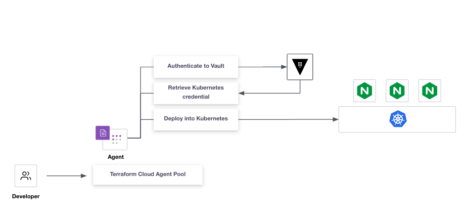
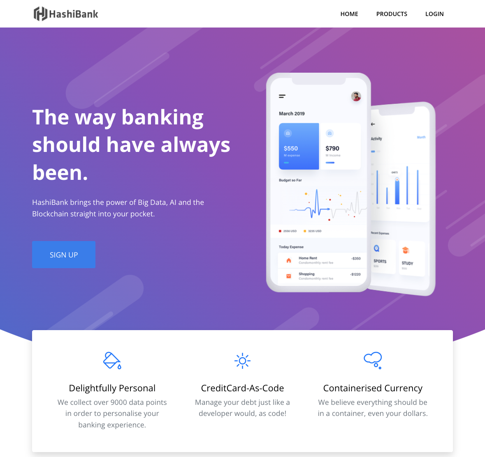
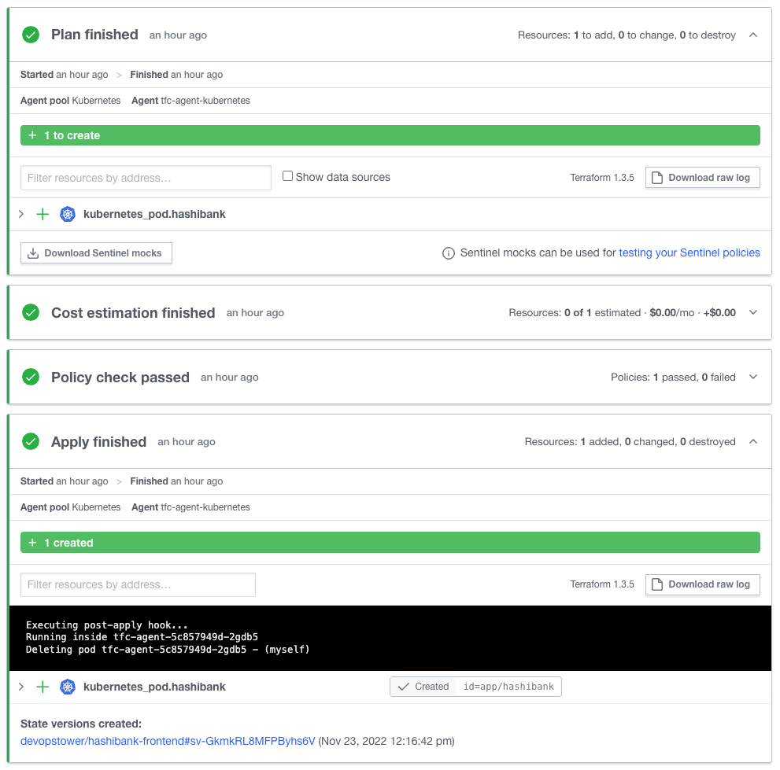

# snapshot-vault-kubernetes-secrets-engine


This repo deploys a single Vault node, running in `-dev` mode, onto GKE. 

Then it deploys an example web application via Terraform Cloud. The ServiceAccount used by the Terraform Cloud Agent to deploy the web application is generated on-demand via [Vault's Kubernetes Secrets Engine](https://developer.hashicorp.com/vault/docs/secrets/kubernetes).

Although this example was written for GKE, porting this to another distribution of Kubernetes would only require minor changes to the Ingress objects found in `deploy/ingress`.



# Prerequisites
- GKE Cluster
- `kubectl`
- `helm`
- `gcloud`
- `vault`

## Deployment Steps
1. Kubernetes namespaces
2. Vault ServiceAccount and ClusterRoleBindings
3. Vault
4. Ingress
5. TFC Cloud Agents
6. Configure Vault
7. Example web app.

### Step 1 - Deploy Kubernetes Namespaces
Deploy 3 namespaces.
- app - Used by the example web app.
- infra - Used by Vault
- tfc - Used by the Terraform Cloud Agents

```bash
sh demo.sh namespaces
```

### Step 2 - Deploy Vault ServiceAccount and ClusterRoleBindings
Create a ServiceAccount with the cluster-admin permissions. This role is far to permissive for anything other than a demo.
```bash
sh demo.sh serviceaccount
```

### Step 3 - Deploy Vault
Deploy a single node of Vault, running in dev mode.
```
sh demo.sh vault
```

### Step 4 - Deploy Ingress
Deploy Services for HashiBank and Vault. In GKE, we deploy Kubernetes Services of `type: LoadBalancer` which then provisions a Cloud Loadbalancer mapped to the Service.

```bash
sh demo.sh ingress
```

### Step 5 - Deploy Terraform Cloud Agents
This step requires that you already have a Terraform Cloud Agent token exported as an environment variable. This guide won't go into the detail of configuring Terraform Cloud or Agents, however, here is a link to the official documentation on [setting up Agents](https://developer.hashicorp.com/terraform/cloud-docs/agents/agents).

In this example, we deploy a Terraform Cloud agent where the image has been customized to include a Post-apply hook that deletes the Pod once it's finished the Terraform Apply. 

The reason why we delete the Pod is to invalidate the Kubernetes MountedServiceAccount token that the Pod had access to. This means that if anyone exfiltrated the token from the MountedServiceAccount, it would only be valid for a short amount of time.

```bash
export TFC_AGENT_TOKEN=<insert-your-agent-token-here>
sh demo.sh tfc-agent
```

### Step 6 - Configure Vault
#### Configuring Kubernetes Authentication
```bash
export VAULT_ADDR="http://$(kubectl -n infra get svc vault-external -o json | jq -r '.status.loadBalancer.ingress[0].ip')"
export VAULT_TOKEN=root

export CLUSTER_ZONE=australia-southeast1
export CLUSTER_NAME=my-cluster

export VAULT_SA_NAME=$(kubectl -n infra get sa vault-cluster-admin -o jsonpath="{.secrets[*]['name']}")
export SA_JWT_TOKEN=$(kubectl -n infra get secret $VAULT_SA_NAME -o jsonpath="{.data.token}" | base64 --decode; echo)
export SA_CA_CRT=$(kubectl -n infra get secret $VAULT_SA_NAME -o jsonpath="{.data['ca\.crt']}" | base64 --decode; echo)
export K8S_HOST="https://$(gcloud container clusters describe ${CLUSTER_NAME} --zone ${CLUSTER_ZONE} --format json | jq -r .endpoint)"

vault auth enable kubernetes

vault write auth/kubernetes/config \
        token_reviewer_jwt="$SA_JWT_TOKEN" \
        kubernetes_host="$K8S_HOST" \
        kubernetes_ca_cert="$SA_CA_CRT"

vault write auth/kubernetes/role/tfc \
        bound_service_account_names=tfc-agent \
        bound_service_account_namespaces='tfc' \
        policies=tfc \
        ttl=1h

vault policy write tfc - << EOF
path "auth/token/create" {
 capabilities = ["update"]
}
path "kubernetes/creds/generated-role" {
  capabilities = ["create", "update"]
}
EOF
```

##### Troubleshooting Kubernetes Authentication
To confirm that the Kubernetes authentication method is working, run the following commands from inside the Terraform Cloud Agent. A successful configuration will result in a Vault token being issued.
```bash
export SA_TOKEN=$(cat /var/run/secrets/kubernetes.io/serviceaccount/token)
export VAULT_TOKEN=$(curl \
    --request POST \
    --data '{"jwt": "'"$SA_TOKEN"'", "role": "tfc"}' \
    http://vault.infra.svc:8200/v1/auth/kubernetes/login| jq -r .auth.client_token)

echo $VAULT_TOKEN
```

#### Configuring Kubernetes Secrets Engine
Configure the Kubernetes Secrets Engine and create the policy for the tfc agent.
```bash
sh demo.sh vault-config
```

Validate
```bash
vault write kubernetes/creds/cicd-write kubernetes_namespace=app
WARNING! The following warnings were returned from Vault:

  * the created Kubernetes service accout token TTL 48h0m0s is less than the
  Vault lease TTL 768h0m0s; capping the lease TTL accordingly

Key                          Value
---                          -----
lease_id                     kubernetes/creds/cicd-write/mZa7qLxsYMqStSROhgNUMjSQ
lease_duration               48h
lease_renewable              false
service_account_name         v-token-cicd-wri-1669166018-pskgvgsgdiou7ohmzmg6fu3e
service_account_namespace    app
service_account_token        eyJhbGciOiJSUzI1NiIsImt.....

kubectl get serviceaccount -n app
NAME                                                   SECRETS   AGE
default                                                1         61m
v-token-cicd-wri-1669166018-pskgvgsgdiou7ohmzmg6fu3e   1         6s
```


### Step 7 - Deploy an example web app
Create a Terraform Cloud workspace with the following config.
- VCS driven workspace
- path set to `deploy/hashibank`
- Agent pool set to the agent configure in Step 5



Now you should have deployed the HashiBank app into the app namespace.

```bash
kubectl get pods -n app
NAME        READY   STATUS    RESTARTS   AGE
hashibank   1/1     Running   0          72m
```

Browsing to your HashiBank ingress IP address will show the following webpage.


### Further reading
Still now sure why why we delete the tfc-agent pod after its executure our Terraform Cloud run. A more detailed explanation is available [here](why-do-we-delete-the-tfc-agent.md).
 

## Build the Terraform Cloud Agent with the Post-Apply hook
```
cd build/tfc-agent
docker build -t jamiewri/tfc-agent-kubernetes:1.4 .
docker push jamiewri/tfc-agent-kubernetes:1.4
```

## Revoking ServiceAccounts
Revoke all leases for the mount
```bash
vault lease revoke \
  -prefix kubernetes
```

Revoke all leases for role
```bash
vault lease revoke \
  -prefix kubernetes/creds/cicd-write
```
